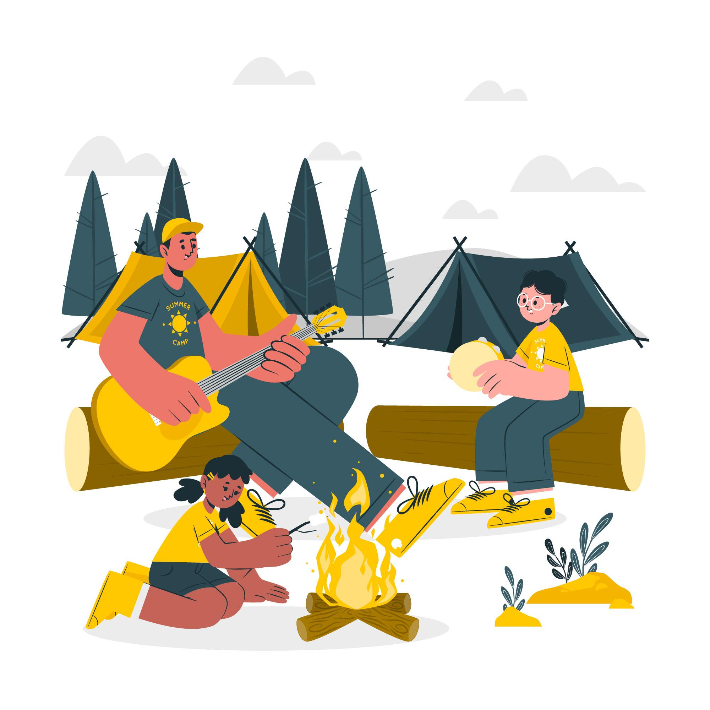

# Campfire

This is our playbook. Here you will find a collection of guides for working in the Digital Products team at Unios.

### [Team Overview](./team-overview)

- [What we do](./team-overview#what-we-do)
- [Our culture and principles](./team-overview#our-culture-and-principles)

### [How We Work](./how-we-work)

- [Our tech stack](./how-we-work#our-tech-stack)
- [Development machines](./how-we-work#development-machines)
- [A typical dev day](./how-we-work#a-typical-dev-day)
- [Project management](./how-we-work#project-management)
- [Branching](./how-we-work#branching)
- [Code style](./how-we-work#code-style)

### [How We Collaborate](./how-we-collaborate)

- [Meetings](./how-we-collaborate#meetings)
- [Internal communication](./how-we-collaborate#internal-communication)
- [Project Management](./how-we-collaborate#project-management)

### New Starters

- Welcome
- Startup Checklist
- Your first day
- Your first week
-

### Our Rituals

- Daily Standups
- Weekly WIPs
- Fortnightly Retros
- Back-to-base Events
- Hackathons

### [Software Development](./software-development)

- Our Tech Stack
- Development Machines
- Environments
- Testing
- Source Control
- Versioning
- Style Guide

### Design & Front-end development

- Design System
- Tools
- Mobile-aware

Markdown - github flavoured markdown

### Working on Projects

- README-driven projects
- Branching / Trunk-based Development
- Feature Toggles

## Why 'Campfire'?

The name 'Campfire' was chosen by our Lead Front-end Developer, [Richard Lindon](https://github.com/richardlindon).

Campfires are recognised around the world as a place for gathering; for discussion; for reflection; and, for learning. They are where ideas can be shared and advice can be passed on. All are welcome at the campfire, and all are free to participate in the discussion.

We are striving to build this type of open and collaborative community in the Digital Products team at Unios.

 
 
 

