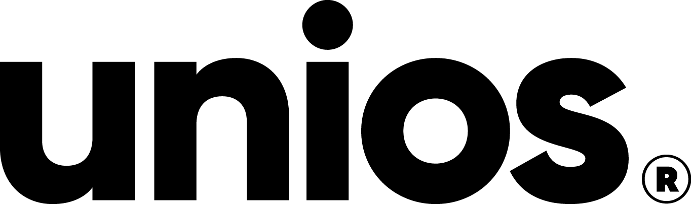

# Team Overview

_"The task of the software development team is to engineer the illusion of simplicity." - Grady Booch_

## What we do

The Digital Products team designs, develops and maintains software for Unios. We are a small, geographically distributed team with members working out of our headquarters in Perth, Australia; and our office in Ho Chi Minh City, Vietnam.

Founded in August 2020, our team has two primary objectives:

1. to improve the productivity, efficiency and satisfaction of teams and departments at Unios by optimising processes and operations with bespoke software; and,
1. to facilitate competitive advantage by providing consumers with effective and innovative software solutions that address areas-of-difficulty that exist within the lighting industry.

The Digital Products team reports to Henry Luong, [Head of Brand and Digital Products](https://premiuml.sharepoint.com/sites/australia/Shared%20Documents/Forms/AllItems.aspx?originalPath=aHR0cHM6Ly9wcmVtaXVtbC5zaGFyZXBvaW50LmNvbS86Zjovcy9hdXN0cmFsaWEvRWk2WDdLWERKTDVPaWNUVUkzN0trNHNCRXFkUkE1eEJONjVUMlV1cExGeFh2UT9ydGltZT1LX2dnU3A2YTJVZw&id=%2Fsites%2Faustralia%2FShared%20Documents%2FGeneral%2FUnios%20Foundations%20Documents%2FPerformance%20Profiles%2FBrand%20%26%20Digital%20Products%2FPerformance%20Profile%20%28Head%20of%20Brand%20%26%20Digital%20Products%29%2Epdf&parent=%2Fsites%2Faustralia%2FShared%20Documents%2FGeneral%2FUnios%20Foundations%20Documents%2FPerformance%20Profiles%2FBrand%20%26%20Digital%20Products).

_NOTE: Details of roles and reporting lines throughout Unios can be found in the official [Unios Foundations](https://premiuml.sharepoint.com/sites/australia/Shared%20Documents/Forms/AllItems.aspx?originalPath=aHR0cHM6Ly9wcmVtaXVtbC5zaGFyZXBvaW50LmNvbS86Zjovcy9hdXN0cmFsaWEvRWk2WDdLWERKTDVPaWNUVUkzN0trNHNCRXFkUkE1eEJONjVUMlV1cExGeFh2UT9ydGltZT1LX2dnU3A2YTJVZw&id=%2Fsites%2Faustralia%2FShared%20Documents%2FGeneral%2FUnios%20Foundations%20Documents&viewid=db25c798%2D68c7%2D4fd7%2Da831%2D113869b9c3de) documentation._

## Our culture and principles

### Continuous improvement

TODO:

## Eager integration

TODO:

### Automate all the things

TODO:

### Use the best tool for the job

Overzealous devotion to particular platforms and technology stacks can sometimes put developers in the unfortunate position of _banging a square peg into a round hole_. We are cautious of this and broadly adopt the philosophy of "using the best tool for the job".

### DevOps

Historically, organisations have dilineated between the responsibilities of developers (i.e. those who write the code) and I.T. operations (i.e. those who deploy and manage the solution). Such an approach lends itself to focussed expertise, formalised communication channels, and, rigid release activities.

In contrast to this, our team adopts a DevOps philosophy, merging the realms of software development and system administration. Put simply, our developers "own the entire lifecycle": collectively, we are responsible for coding the solution, setting up required infrastructure, deploying projects, and all maintenance tasks thereafter. This approach lends itself to increased agility.

## Roles and Responsibilities

### Software Developer

TODO:

### Front-end Software Developer

TODO:

### Lead Software Developer

TODO:

### Principal Developer

TODO:

 
 
 

